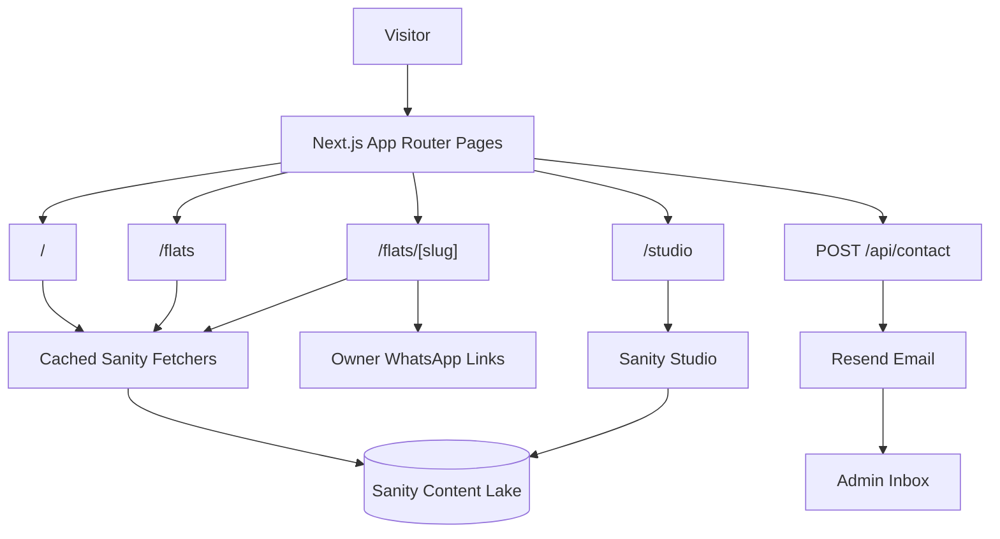
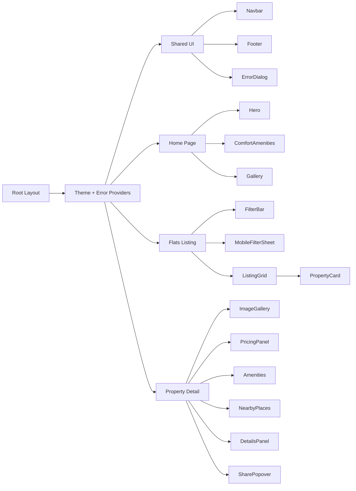
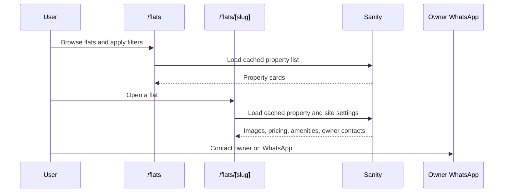

# We Live in Bangalore

A zero-brokerage Bangalore rentals site for browsing owner-listed flats, viewing property details, and contacting owners directly through WhatsApp.

The app is built with the Next.js App Router, Sanity CMS, Tailwind CSS, and TypeScript. Public pages are optimized for fast browsing, while property content is managed through the built-in Sanity Studio at `/studio`.

## Tech Stack

| Area | Technology | Why it is used |
| --- | --- | --- |
| Framework | Next.js 16 App Router | File-based routes, server-rendered pages, API route handlers, metadata, and image optimization. |
| UI | React 19 + TypeScript | Typed component model for listing cards, filters, property pages, and shared UI. |
| Styling | Tailwind CSS 4 | Utility-first styling with project theme colors in `src/app/globals.css`. |
| Content | Sanity + next-sanity | Property documents, site settings, images, owner contacts, and the `/studio` admin experience. |
| Images | Sanity image CDN + `next/image` config | Remote property images from `cdn.sanity.io` with controlled quality settings. |
| Motion and icons | Framer Motion + Lucide React | Listing transitions, filter sheet animation, and consistent UI icons. |
| Email | Resend | Sends property enquiry emails from `src/app/api/contact/route.ts`. |
| Tooling | ESLint 9 + TypeScript 5 | Static checks for code quality and typed application code. |

## Architecture Overview



Simple version: visitors use the public Next.js pages, those pages read property data from Sanity through cached fetcher functions, and admins manage the same content from Sanity Studio. Property contact actions open WhatsApp, and the app also includes a local contact API route that can send enquiry emails through Resend.

## Design Architecture



The design is split into three layers:

- **Global shell:** `src/app/layout.tsx` loads the Quicksand font, wraps the app with theme/error providers, and applies shared global styles.
- **Page sections:** route files in `src/app` compose the main experiences: home, listings, property details, admin studio, and contact API.
- **Reusable components:** `src/components` holds UI blocks such as navigation, listing cards, filters, galleries, pricing panels, and property detail sections.

## User Experience Flow



## Project Structure

```text
src/
  app/
    page.tsx                  Home page
    flats/page.tsx            Property listing page
    flats/[slug]/page.tsx     Property detail page
    apartments/page.tsx       Redirects to /flats
    api/contact/route.ts      Enquiry email API
    studio/[[...index]]       Embedded Sanity Studio
  components/
    home/                     Home and listing UI
    property/                 Property detail UI
    ui/                       Shared navigation, footer, errors, logo
  providers/                  App-level providers
  sanity/
    lib/                      Sanity client, queries, image helpers, fetchers
    schemaTypes/              Sanity document schemas
  types/                      Shared TypeScript interfaces
```

## Key Data Model

The primary content type is `property`, defined in `src/sanity/schemaTypes/property.ts`.

It includes:

- Property identity: title, slug, property type, images, and optional video URL.
- Location: primary area, nearby areas, and Google Maps embed URL.
- Pricing: rent, deposit, maintenance, and square feet.
- Living details: furnishing, facilities, balcony, facing, floor, pets, nearby places, and tenant preference.
- Contact data: owner contact numbers used to build WhatsApp links.

Site-wide settings, such as WhatsApp defaults, contact email, admin name, and gallery images, come from the `siteSettings` singleton document.

## Routes

| Route | Purpose |
| --- | --- |
| `/` | Home page with brand story, stats, comfort amenities, and gallery. |
| `/flats` | Browse all available flats with filters, sorting, and property cards. |
| `/flats/[slug]` | Detailed property page with gallery, pricing, amenities, location, and contact actions. |
| `/apartments` | Permanent redirect to `/flats`. |
| `/studio` | Sanity Studio admin interface. |
| `/api/contact` | POST endpoint for enquiry emails through Resend. |

## Caching and Rendering

Most public pages are server components that fetch Sanity data before rendering. The app uses `unstable_cache` in `src/sanity/lib/fetchers.ts` with short revalidation windows:

- Properties revalidate every 60 seconds.
- Individual property pages revalidate every 60 seconds.
- Site settings revalidate every 300 seconds.

Interactive browser-only behavior, such as saved listing filters, mobile filter sheets, galleries, share popovers, and contact controls, lives in client components.

## Environment Variables

Create a local environment file with the values below:

```bash
NEXT_PUBLIC_SANITY_PROJECT_ID=your_project_id
NEXT_PUBLIC_SANITY_DATASET=production
NEXT_PUBLIC_SANITY_API_VERSION=2024-05-26
NEXT_PUBLIC_SITE_URL=http://localhost:3000
NEXT_PUBLIC_ADMIN_EMAIL=admin@example.com
RESEND_API_KEY=your_resend_api_key
```

Notes:

- `NEXT_PUBLIC_SANITY_PROJECT_ID` and `NEXT_PUBLIC_SANITY_DATASET` are required for the app and Studio to start.
- `RESEND_API_KEY` is required only for sending enquiry emails.
- `NEXT_PUBLIC_SITE_URL` is used when building share/contact links.
- `NEXT_PUBLIC_ADMIN_EMAIL` is optional and is shown in error recovery UI.

## Getting Started

Install dependencies:

```bash
npm install
```

Run the development server:

```bash
npm run dev
```

Open `http://localhost:3000` for the public site and `http://localhost:3000/studio` for the Sanity Studio.

## Scripts

```bash
npm run dev      # Start the local Next.js dev server
npm run build    # Create a production build
npm run start    # Run the production build
npm run lint     # Run ESLint
```

## Design Notes

- The visual style uses warm dark sections, light listing surfaces, orange primary actions, rounded panels, and bold Quicksand typography.
- Listing discovery is designed around fast scanning: filters on desktop, a bottom filter action on mobile, budget sorting, and recommended property priority.
- Property detail pages focus on decision-making: images first, pricing/contact panel beside it, then amenities, nearby places, property facts, and map.
- Admin content is intentionally centralized in Sanity so new flats and site settings can be updated without changing application code.
